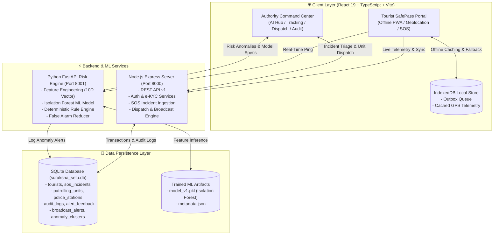

# 🛡️ Suraksha Setu (सुरक्षा सेतु)
### AI-Powered, Context-Aware Tourist Safety Monitoring & Emergency Command System

Suraksha Setu is an enterprise-grade, offline-first tourist safety and emergency response platform designed for mountainous and high-risk tourism corridors (pilot region: **Kullu – Manali – Rohtang, Himachal Pradesh**). 

<<<<<<< Updated upstream
The platform bridges tourists and law enforcement command centers through a unified ecosystem combining **offline-first SOS dispatch**, an **unsupervised machine learning anomaly detection engine (Isolation Forest)**, **explainable rule-based risk scoring**, **cryptographic e-KYC / digital identity verification**, and an **immutable audit trail**.
=======
The platform bridges travelers and law enforcement command centers through a unified ecosystem combining **offline-first SOS dispatch**, an **unsupervised machine learning anomaly detection engine (Isolation Forest)**, **explainable rule-based risk scoring**, **cryptographic e-KYC / digital identity verification**, and an **immutable audit trail**.
>>>>>>> Stashed changes

---

## 📑 Table of Contents
1. [System Architecture & Data Flow](#-system-architecture--data-flow)
2. [Key Features & Implementation](#-key-features--implementation)
   - [1. Offline-First SOS Panic Pipeline](#1-offline-first-sos-panic-pipeline)
   - [2. AI Anomaly Detection & Context-Aware Risk Engine](#2-ai-anomaly-detection--context-aware-risk-engine)
   - [3. Digital Identity, DigiLocker e-KYC & Verifiable Audit Trail](#3-digital-identity-digilocker-e-kyc--verifiable-audit-trail)
   - [4. Tourist SafePass Portal](#4-tourist-safepass-portal)
   - [5. Police Authority Command & Dispatch Hub](#5-police-authority-command--dispatch-hub)
   - [6. Dynamic Google Maps & Geo-Fencing Engine](#6-dynamic-google-maps--geo-fencing-engine)
3. [Technology Stack](#-technology-stack)
4. [Database & Storage Architecture](#-database--storage-architecture)
5. [Backend API Reference](#-backend-api-reference)
6. [Getting Started & Installation](#-getting-started--installation)
7. [Automated ML Testing & Simulation](#-automated-ml-testing--simulation)
8. [Data Disclosures & Pilot Corridor](#-data-disclosures--pilot-corridor)

---

## 🏗️ System Architecture & Data Flow



---

## 🚀 Key Features & Implementation

### 1. Offline-First SOS Panic Pipeline
Designed specifically for remote Himalayan passes with zero cellular connectivity:
- **One-Touch Trigger with Countdown**: 5-second cancelable countdown prevents accidental triggers.
- **Fail-Safe Location Acquisition**: Automatically grabs high-accuracy GPS coordinates via `navigator.geolocation`. If GPS is unavailable or blocked, falls back seamlessly to the last known position stored locally.
- **IndexedDB Local Outbox**: When offline, the SOS payload (coordinates, battery level, timestamp, audio note) is saved to the local `smart_tourist_safety_sos` IndexedDB outbox.
- **Background Auto-Sync**: A window `online` event listener automatically detects network restoration and flushes all queued offline SOS alerts to `/api/v1/sos`.
- **Audio Distress Recording**: Records short voice memos attached to emergency dispatches.
- **Police PCR Unit Dispatch**: Live mapping matches the incident location with the nearest active patrol unit (`PCR Unit 2`, `PCR Unit 4`, etc.) and calculates optimal driving routes.

### 2. AI Anomaly Detection & Context-Aware Risk Engine
To prevent black-box unpredictability, Suraksha Setu combines deterministic safety rules with unsupervised machine learning:
- **Unsupervised Machine Learning (Isolation Forest)**:
  - Preprocesses telemetry into a **10-dimensional feature vector**: cyclic time encoding (`sin_hour`, `cos_hour`), derived velocity, dwell time, expected route deviation, distance to nearest safe zone, distance to nearest hazard hotspot, geofence danger tier, battery drain rate, and connectivity status.
  - Normalized anomaly score $[0, 1]$ generated using a calibrated Sigmoid function over the model's decision function.
  - Generates `model_v1.pkl` and provides comprehensive `metadata.json` model specifications.
- **Explainable Rule-Based Risk Engine**:
  - Deterministic evaluation of manual SOS (+40 pts), critical danger geofence breach (+30 pts), severe curfew violation (+20 pts), extended inactivity / dwell time (+15 pts), and signal loss.
  - Transparent point-by-point breakdown displayed in the Command Center UI.
- **False Alarm Reducer**:
  - Filters out transient anomalies caused by traffic bottlenecks, authorized night travel on national highways, or battery conservation modes.
  - Contextual overrides reduce false positives before alarming command officers.
- **Human-in-the-Loop Feedback**:
  - Command officers can review AI alerts and tag them as **Confirmed Threat** or **False Positive**.
  - Feedback is persisted in `alert_feedback` to retrain and calibrate future model iterations.

### 3. Digital Identity, DigiLocker e-KYC & Verifiable Audit Trail
- **DigiLocker Identity Integration**: Tourists authenticate identity credentials (Aadhaar / Passport / Voter ID) creating a verified digital profile with cryptographic verification hashes.
- **Digital Tourist Pass**: Generates a verifiable digital pass with unique Tourist ID (`TR-XXXX`), Digital Band ID (`BAND-XXXX`), emergency contacts, blood group, and downloadable PDF summary.
- **Immutable Audit Logging**:
  - Every sensitive officer lookup (`TOURIST_LOOKUP`), unit dispatch (`DISPATCH_UNIT`), broadcast alert, or ticket resolution is cryptographically recorded in the `audit_logs` table.
  - Logs officer badge, timestamp, target tourist ID, IP address, and official justification to guarantee GDPR/DPDP-compliant privacy enforcement.

### 4. Tourist SafePass Portal
- **Post-Sign-In Live GPS Consent**: Acquires browser geolocation, verifies safety status, and registers the active travel corridor.
- **Interactive Itinerary & Hazard Evaluation**:
  - Add, view, and **Modify** destinations, travel dates, hotels, and planned activities.
  - Automatic AI safety verification classifies itineraries into **Safe Corridor**, **Weather Advisory**, or **High Risk Pass** (e.g., Rohtang Pass, Solang Valley).
- **Safety Status Badge**: Displays real-time status (`Safe`, `Caution`, `High Risk`) and nearest police station / hospital emergency contacts.

### 5. Police Authority Command & Dispatch Hub
- **AI Hub & Risk Feed**: Live telemetry stream evaluating anomaly risk scores for all active tourists across the corridor.
- **Tourist Tracking Matrix**: Real-time table with search, status filters (`Safe`, `Caution`, `High Risk`), battery levels, and last-seen timestamps.
- **SOS Incident Room**: Interactive incident manager with audio recording playback, severity classification (`Critical`, `Moderate`), and 1-click PCR patrol dispatch.
- **Mass Emergency Broadcast**: Multilingual alert dispatch system supporting SMS fallback beacons and app notifications targeted to specific hazard zones.
- **Auditing & Analytics**: Complete activity logs, anomaly cluster charts, and system compliance metrics.

### 6. Dynamic Google Maps & Geo-Fencing Engine
- **Expanded Map Viewport**: 460px high-resolution interactive Google Maps embed with roadmap, satellite, and terrain view modes.
- **Live Geo-Fence Synchronization**: Instant map synchronization upon clicking defined hazard corridors (*Solang Valley, Rohtang Glacier Pass, Old Manali Sector*).
- **Place Search & Preset Chips**: One-click quick zoom to landmarks (*Solang Valley, Rohtang Pass, Old Manali, Hadimba Temple, Atal Tunnel, Kasol Market, Sissu Valley*).
- **Point-to-Point Directions**: Dedicated Origin ➔ Destination routing query builder with external Google Maps navigation links.
- **Safety Heatmaps**: Real-time crowd density and hazard clustering visualization using Canvas overlays.

---

## 🛠️ Technology Stack

| Layer | Technology | Purpose |
| :--- | :--- | :--- |
| **Frontend UI** | React 19, TypeScript, Vite | Ultra-fast, reactive single-page dashboard |
| **Styling & Icons** | Tailwind CSS v4, Lucide React, Motion | Sleek glassmorphic dark/light UI with smooth animations |
| **Mapping** | Google Maps Embed API, Canvas Heatmaps | Dynamic route directions, Geo-Fence tracking, and density overlays |
| **Client Storage** | IndexedDB, Service Worker (PWA) | Offline outbox queue for SOS alerts and cached GPS coordinates |
| **Command Server** | Node.js, Express, tsx | REST API v1, master data coordination, audit tracking, e-KYC |
| **Machine Learning** | Python 3.11, Scikit-Learn, Joblib | Unsupervised `IsolationForest` anomaly model and 10D feature vectorizer |
| **Risk Engine API** | FastAPI, Uvicorn, Pydantic, PyYAML | Sub-millisecond risk scoring, rules engine, and false-alarm reduction |
| **Primary Database** | SQLite (`suraksha_setu.db`) | Relational master database storing tourists, incidents, logs, and units |

---

## 💾 Database & Storage Architecture

The platform uses a hybrid storage model: **IndexedDB** on the client for offline tolerance, and **SQLite (`suraksha_setu.db`)** on the backend for centralized command operations.

### SQLite Schema (`suraksha_setu.db`)
1. **`tourists`**: ID, full name, phone, nationality, passport hash, digital band ID, KYC verification status, hotel, live lat/lng, battery level, safety status, SOS history.
2. **`sos_incidents`**: Incident ID, tourist ID, timestamp, lat/lng, status (`New`, `Dispatched`, `Resolved`), severity, assigned unit, audio recording URL, trigger source.
3. **`patrolling_units`**: Unit ID, officer in charge, vehicle number, contact, current lat/lng, status (`Patrolling`, `Dispatched`, `Standby`).
4. **`police_stations`**: Station ID, jurisdiction name, contact phone, lat/lng, active officers count.
5. **`hospitals`**: Facility ID, name, emergency helpline, lat/lng, available ICU beds, ambulance fleet.
6. **`anomaly_clusters`**: Cluster ID, zone name, risk level (`Low`, `Medium`, `High`), anomaly score, tourists affected count.
7. **`broadcast_alerts`**: Alert ID, title, message body, target zone, severity, timestamp, delivery channels (SMS, Push).
8. **`audit_logs`**: Log ID, timestamp, officer badge, action type (`TOURIST_LOOKUP`, `DISPATCH_UNIT`, etc.), target ID, reason, IP address.
9. **`ai_logs`**: Anomaly detection inference logs, confidence metrics, feature vectors.
10. **`alerts` & `alert_feedback`**: Risk engine anomaly alerts and human-in-the-loop validation labels (`confirmed` / `false_positive`).
11. **`location_history`**: Historical telemetry pings for route reconstruction.

---

## 📡 Backend API Reference

### Express Command Server (`http://localhost:8000/api/v1`)
- `GET /health` — Service health check
- `GET /tourists` — List and search tourists by name, phone, band ID, or safety status
- `POST /tourists` — Register a new tourist profile with e-KYC data
- `GET /tourists/:id` — Fetch complete profile (with optional `?audit=true` logging)
- `PATCH /tourists/:id` — Update live location, battery level, or safety status
- `GET /sos` — Fetch all active and resolved emergency incidents
- `POST /sos` — Ingest emergency SOS alert (online or synced from offline queue)
- `PATCH /sos/:id` — Update incident status or assign a patrolling unit
- `GET /responders/units` — List all patrolling PCR vehicles and coordinates
- `POST /responders/dispatch` — Dispatch a patrolling unit to an active incident
- `GET /responders/stations` — List police stations in the jurisdiction
- `GET /responders/hospitals` — List medical centers and ambulance coordinates
- `GET /broadcasts` — List all historical emergency broadcasts
- `POST /broadcasts` — Dispatch a new emergency broadcast across channels
- `GET /audit-logs` — Retrieve immutable officer action audit trail
- `POST /audit-logs` — Record a new audit log entry

### FastAPI Risk Engine (`http://localhost:8001`)
- `POST /tourist/location` — Ingests a single telemetry ping and returns risk score + feature breakdown
- `GET /model/metadata` — Returns Isolation Forest model specifications, features, and training disclosure
- `POST /alerts/{alert_id}/feedback` — Records officer feedback (`confirmed` or `false_positive`)
- `POST /sos/external` — Receives external panic beacon triggers with fallback SMS notification

---

## 🏁 Getting Started & Installation

### Prerequisites
- **Node.js** (v18.0 or higher) & **npm**
- **Python** (v3.10 or v3.11)

### 1. Clone & Install Frontend & Server Dependencies
```bash
# Clone the repository
git clone https://github.com/AaryaSingh5/sureksha-Setu_frontend-_backend-_integration_-with-ai-ml.git
cd sureksha-Setu_frontend-_backend-_integration_-with-ai-ml

# Install Node packages
npm install
```

### 2. Set Up Python Risk Engine & Virtual Environment
```bash
# Navigate to the risk engine directory
cd risk_engine

# Create virtual environment
python -m venv venv

# Activate virtual environment (Windows PowerShell)
.\venv\Scripts\Activate.ps1
# On macOS / Linux: source venv/bin/activate

# Install Python requirements
pip install -r requirements.txt
```

### 3. Train the Isolation Forest Machine Learning Model
```bash
# Inside risk_engine/ with activated venv:
python train_model.py
```
*Output: Generates `model_v1.pkl` (trained model artifact) and `metadata.json`.*

### 4. Launch the Entire System with a Single Command
Return to the project root:
```bash
cd ..
npm run dev
```

`npm run dev` concurrently launches:
1. **React Web Client** on `http://localhost:3000` (or next available port)
2. **Express Command Backend** on `http://localhost:8000`
3. **FastAPI Python Risk Engine** on `http://localhost:8001`

---

## 🧪 Automated ML Testing & Simulation

To test the risk engine and false-alarm reduction pipeline against simulated real-world scenarios:
```bash
cd risk_engine
.\venv\Scripts\python.exe test_scenarios.py
```
This tests 5 distinct movement scenarios:
1. **Normal Tourist Stroll**: Verifies score stays low and no alarms fire.
2. **High-Risk Geofence Breach (Solang Riverbank)**: Verifies instant risk score spike and danger alert.
3. **Midnight Mountain Pass Anomaly**: Verifies temporal and spatial anomaly detection.
4. **Traffic Congestion / Slow Movement**: Tests False Alarm Reducer to prevent spurious alerts.
5. **Panic Button / SOS Trigger**: Verifies deterministic override to maximum risk score.

A complete trace report is saved to `risk_engine/test_report.txt`.

---

## 🏔️ Data Disclosures & Pilot Corridor

- **Pilot Region**: The spatial definitions, geofences, police stations, and hospital locations are modeled on the **Kullu – Manali – Solang Valley – Rohtang Pass corridor in Himachal Pradesh, India**.
- **Synthetic Training Data**: The Isolation Forest anomaly detector is trained on algorithmically generated normal trajectory distributions simulating high-altitude tourist movements. 
- **Explainability Standard**: The system enforces that ML anomalies can contribute at most **10%** to the overall safety score, ensuring life-critical decisions are anchored on verifiable, deterministic safety rules.

---

<div align="center">
  <sub>Developed for Smart Tourist Safety & Emergency Response • Suraksha Setu 2026</sub>
</div>
